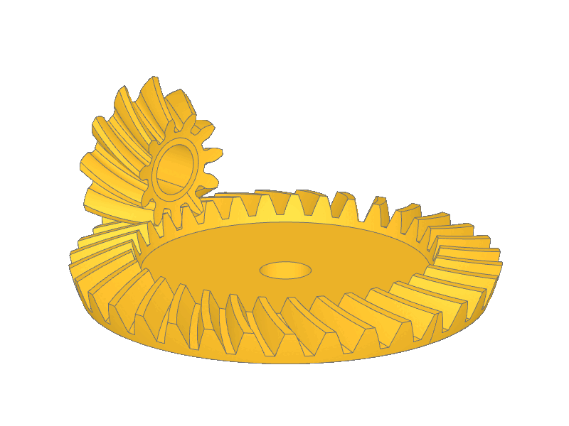
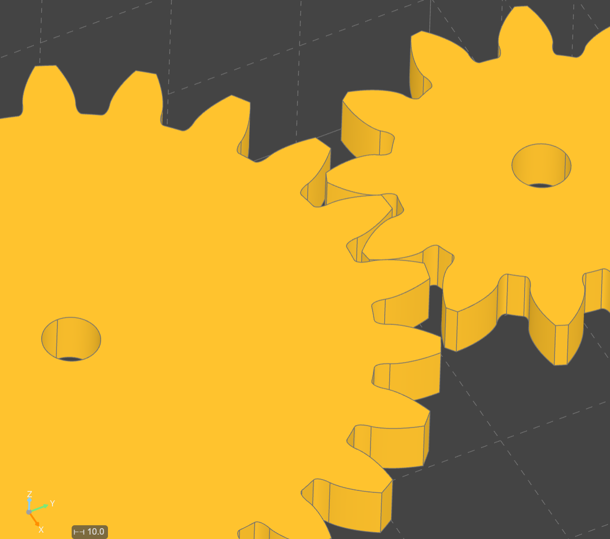

# Python - Gearworks
A gear generator in python.

Py-gearworks is built on build123d CAD package. It focuses on accurate geometric representation of gears, gear-pairs. Design calculations related to strength, pitting, efficiency may be implemented in the future - but currently not supported.

# Installation
Py_gearworks can be installed via pip:
```
pip install py-gearworks
```
```
pip install git+https://github.com/GarryBGoode/py_gearworks
```
Alternatively, you can clone or download this repository and install via this command from the repository root directory:
```
pip install .
```
# Dependencies

py_gearworks CAD model creation uses build123d package: [build123d github](https://github.com/gumyr/build123d)

It is highly recommended, though not strictly necessary to use a python-CAD gui solution.
See [OCP VSCode](https://github.com/bernhard-42/vscode-ocp-cad-viewer) and [CadQuery Editor](https://github.com/CadQuery/CQ-editor).

# Documentation
Docs hosted on [readthedocs](https://py-gearworks.readthedocs.io/en/latest/)

# Features

| Gear Types        | Profile Mods      | Position & Alignment                  |
| -------------     | -------------     | -------------                         |
| Spur              | Undercut          | Std. position                         |
| Helical           | Profile shift     | Backlash-controlled position*         |
| Bevel             | Root/tip fillet   | Axis alignment (bevels and helicals)  |
| Cycloid           | Crowning          | Rotation to align teeth to mesh       |
| Inside-ring       |                   | Axial offset (only spur and helical)

It is a development goal that all (sensible) combination of supported features should be combined.
Profile shifted cycloids don't exist, but inside-ring-bevel cycloids can be made. Undercut and profile shift is available for bevels - but positioning of profile shifted bevels is lacking. Please use complementary profile shifts for bevels.

\* Positioning and backlash design is a bit of work-in-progress. Spur gears and parallel-axis helical gears can be placed with accurate backlash (inc. 0 backlash). This matters for profile shifted gears. Cross-axis helicals and bevel gears can only be positioned via nominal formula (can't adjust backlash via axial distance).




Work in progress / partially supported:
- Racks
- Backlash control
- Contact ratio calculation
- Planetary drive design

Not yet supported:

- Hypoid gears
- Worm gears
- Face / crown gears

Planned upcoming other features
- Backlash, contact ratio and profile shift optimization

# Example
The example is built on VSCode with OCP VScode plugin.
See [examples/examples.py](examples/examples.py) for more.
<!-- BEGIN EXAMPLE: examples/readme_example.py -->
```python
from py_gearworks import *
from ocp_vscode import show
from build123d import *

# create 2 spur gears
gear1 = SpurGear(
    number_of_teeth=12,
    module=2,
    height=4,
    profile_shift=0.3,
)
gear2 = SpurGear(
    number_of_teeth=23,
    module=2,
    height=4,
)

# move and align gear 1 next to gear 2 in the Y direction
# backlash can be optionally specified
# angle_bias conrtols location within backlash range (-1 to 1)
# backlash is a coefficient of module
# there will be 0.2 mm distance between inactive tooth sides in this example
gear1.mesh_to(gear2, target_dir=UP, backlash=0.1, angle_bias=1)

# generate build123d Part objects
gear_part_1 = gear1.build_part()
gear_part_2 = gear2.build_part()

# center-bores are recommended to be added separately via build123d workflow
# center_location_top can be used as a build123d location object
# location * Hole means placement of Hole at that location (build123d syntax)
hole_obj_1 = gear1.center_location_top * Hole(radius=2, depth=4)
gear_part_1 = gear_part_1.cut(hole_obj_1)
hole_obj_2 = gear2.center_location_top * Hole(radius=2, depth=4)
gear_part_2 = gear_part_2.cut(hole_obj_2)

# export to STEP files (build123d export function)
# note: export retains positioning, gear1 will not be at origin
export_step(gear_part_1, "gear1.step")
export_step(gear_part_2, "gear2.step")

# export to DXF files (build123d export function)
gear_wire_1 = gear1.build_boundary_wire()
gear_wire_2 = gear2.build_boundary_wire()

exporter = ExportDXF(unit=Unit.MM, line_weight=0.5)
exporter.add_layer("Layer 1", line_type=LineType.CONTINUOUS)
exporter.add_shape(gear_wire_1, layer="Layer 1")
exporter.add_shape(gear_wire_2, layer="Layer 1")
exporter.write("gears.dxf")

# visualize parts
show(gear_part_1, gear_part_2)
```
<!-- END EXAMPLE -->



# Name conflict and rebrand
This project was originally named gggears - a poor choice, since it was already taken by another, similar project.
I've renamed the project, but some references, URLs might still point to gggears.


# License
Project is licensed under Apache 2.0, see license file for details.
