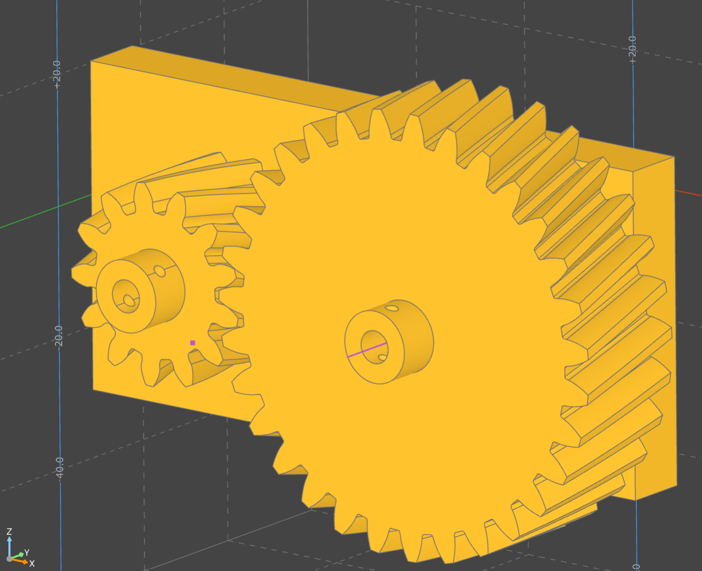
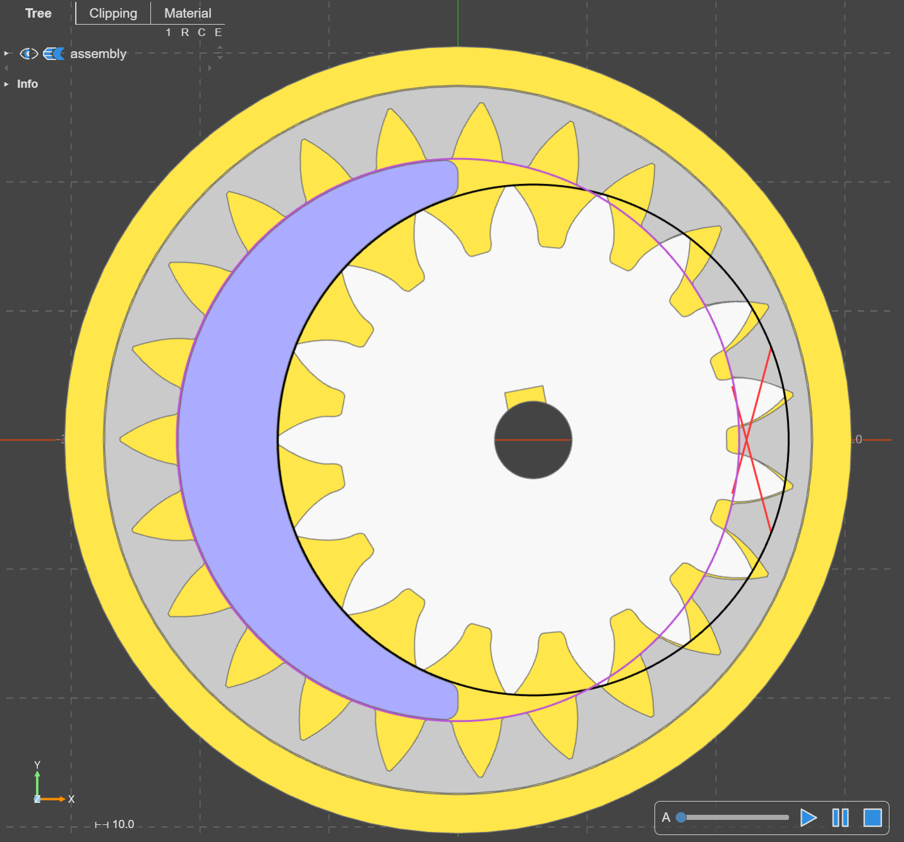

Build123d Workflow Examples
===========================

Simple gears on a backplate
----------------------------

Various properties and methods are made available in the class :py:class:`GearInfoMixin <py_gearworks.wrapper.GearInfoMixin>`. 
The following example demonstrates the creation of a gear-pair and attaching them to a base-plate: 

Highlights:

* You can use \
  :py:attr:`center_location_bottom <py_gearworks.wrapper.GearInfoMixin.center_location_bottom>`, \
  :py:attr:`center_location_top <py_gearworks.wrapper.GearInfoMixin.center_location_top>`, \
  :py:attr:`face_location_bottom <py_gearworks.wrapper.GearInfoMixin.face_location_bottom>`, \
  :py:attr:`face_location_bottom <py_gearworks.wrapper.GearInfoMixin.face_location_bottom>` to align parts with gear centers.
* Note that **center** refers to the pitch circle center and **face** refers to the face (surface) of the gear. These are different for bevel gears.
* :py:attr:`gear.center <py_gearworks.wrapper.GearInfoMixin.center>` is a numpy array, often needs to be converted to a `Vector` for build123d via :py:func:`np2v() <py_gearworks.conv_build123d.np2v>`.
* Ideal center distance can be retrieved after calling the :py:meth:`mesh_to() <py_gearworks.wrapper.InvoluteGear.mesh_to>` method, and calculating the difference of :py:attr:`gear.center <py_gearworks.wrapper.GearInfoMixin.center>` values.

.. note::

    You are free to adjust the axial distance between gears by updating the :py:attr:`gear.center <py_gearworks.wrapper.GearInfoMixin.center>` 
    parameter. Small adjustment is best done after :py:meth:`mesh_to() <py_gearworks.wrapper.InvoluteGear.mesh_to>` has been called. Positioning helpers and properties
    will be updated. However, calculations related to backlash and interference are not yet available.

::

    import py_gearworks as pgw
    from build123d import *
    from ocp_vscode import *

    set_port(3939)

    # this example demonstrates how to create a simple pair of gears and
    # add additional features to them, and then assemble them on a baseplate
    gearmodule = 2
    gearheight = 4
    bore_diameter = 5
    pin_diamaeter = 2
    sleeve_height = 7
    sleeve_thickness = 1

    gear1 = pgw.HelicalGear(
        number_of_teeth=13, module=gearmodule, height=gearheight, helix_angle=pgw.PI / 12
    )
    gear2 = pgw.HelicalGear(
        number_of_teeth=31, module=gearmodule, height=gearheight, helix_angle=-pgw.PI / 12
    )
    gear1.mesh_to(gear2, target_dir=pgw.DOWN)

    # py_gearworks uses numpy arrays for vectors, build123d uses its own Vector class
    # np2v() is shorthand for nppoint2Vector(), which makes the conversion
    gear1_center_vector = pgw.np2v(gear1.center)
    gear2_center_vector = pgw.np2v(gear2.center)
    axial_distance_vector = gear1_center_vector - gear2_center_vector

    with BuildPart() as gear1_part:
        # creating gear part
        gear1.build_part()
        # note: gear1 is moved and rotated to be meshed with gear2 by the mesh_to() method
        # the alignment of the sleeve and pinhole may need to be adjusted
        with Locations((gear1.center_location_top)):
            # note: location of top-center is aligned with tooth no. 0 of the gear
            # the angle is changed from the mesh_to() method and the helix angle as well
            sleeve = Cylinder(
                radius=bore_diameter / 2 + sleeve_thickness,
                height=sleeve_height,
                align=(Align.CENTER, Align.CENTER, Align.MIN),
            )
            loc_pin_hole = Location(
                Vector(0, 0, sleeve_height - pin_diamaeter * 3 / 2),
                (0, 90, 0),
            )
            # Holes with depth=None mean through all the way
            Hole(bore_diameter / 2, depth=None)
            with Locations([loc_pin_hole]):
                Hole(pin_diamaeter / 2, depth=None)
        # revolute joint seems fitting, but rigid could be used as well,
        # since gear rotation animation or simulation is not implemented
        RevoluteJoint(
            "gear_axis",
            axis=Axis(gear1_center_vector, (0, 0, 1)),
            angular_range=(-360, 360),
        )

    with BuildPart() as gear2_part:
        gearpart = gear2.build_part()
        with Locations((gear2.center_location_top)):
            # note: location of top-center is aligned with tooth no. 0 of the gear
            # the angle is changed from the helix angle
            Cylinder(
                radius=bore_diameter / 2 + sleeve_thickness,
                height=sleeve_height,
                align=(Align.CENTER, Align.CENTER, Align.MIN),
            )
            loc_pin_hole = Location(
                Vector(0, 0, sleeve_height - pin_diamaeter * 3 / 2),
                (0, 90, 0),
            )
            # Holes with depth=None mean through all the way
            Hole(bore_diameter / 2, depth=None)
            with Locations([loc_pin_hole]):
                Hole(pin_diamaeter / 2, depth=None)

        RevoluteJoint(
            "gear_axis",
            axis=Axis(gear2_center_vector, (0, 0, 1)),
            angular_range=(-360, 360),
        )

    with BuildPart() as baseplate:
        box = Box(100, 10, 50)
        face = box.faces().sort_by(Axis.Y)[0]
        # note: the orientation of the face is such that the local Y aligns with global X
        loc = face.center_location
        # mult operation on locations means locate 2nd location within 1st location
        loc_g1 = loc * Location(axial_distance_vector * 0.5)
        loc_g2 = loc * Location(-axial_distance_vector * 0.5)
        with Locations([loc_g1, loc_g2]):
            Hole(bore_diameter / 2, depth=50)
        # joints don't seem to work well with Locations context manager
        # so they are created outside of it with joint_location specified as kwarg

        # build123d joint system needs pairs of rigid-revolute joints,
        # revolute-revolute pair does not work
        RigidJoint("gear1_axis", joint_location=loc_g1)
        RigidJoint("gear2_axis", joint_location=loc_g2)

    baseplate.joints["gear1_axis"].connect_to(gear1_part.joints["gear_axis"])
    baseplate.joints["gear2_axis"].connect_to(gear2_part.joints["gear_axis"])

    show_all(render_joints=True)

Crescent Gear Pump
-------------------

This example demonstrates building a gear pump. The design is missing fasteners and seals,
but showcases the gear generator and its helper functions for build-123d workflow.

Highlights:

* You can use `center_location_bottom` and `center_location_top` to align parts with gear centers.
* The :py:attr:`radii_data_top <py_gearworks.wrapper.GearInfoMixin.radii_data_top>` method generates reference curves for the gear.
* The :py:class:`LineOfAction <py_gearworks.wrapper.GearInfoMixin.LineOfAction>` class is available for generating the line of action between gears.
* Sometimes converter functions are needed such as :py:func:`arc_to_b123d() <py_gearworks.conv_build123d.arc_to_b123d>` and :py:func:`line_to_b123d() <py_gearworks.conv_build123d.line_to_b123d>`. These convert between py_gearworks' own geometry classes and build123d geometry.

.. image:: ./assets/gearpump_1.png
  :align: center
  :alt: token gearpump_1

::

    import py_gearworks as pgw
    from build123d import *
    from ocp_vscode import *

    set_port(3939)

    gearheight = 10
    axis_diameter = 6
    port_diameter = 5
    gearmodule = 2
    wall_thickness = 3

    gear1 = pgw.SpurGear(
        number_of_teeth=17,
        module=gearmodule,
        height=gearheight,
        addendum_coefficient=1.0,
        z_anchor=0.5,
    )
    gear2 = pgw.SpurRingGear(
        number_of_teeth=23,
        module=gearmodule,
        height=gearheight,
        addendum_coefficient=1.2,
        dedendum_coefficient=0.6,
        outside_ring_coefficient=2,
        z_anchor=0.5,
        # I used the angle kwarg to iteratively check for interference
        angle=0.135,
    )
    gear1.mesh_to(gear2)
    gear1.center += pgw.LEFT * 0.1

    with BuildPart() as gearpart1:
        gear1.build_part()
        with Locations((gear1.center_location_bottom)):
            # notch
            # a rectangular hole on the radius in Y direction
            with Locations((0, axis_diameter / 2, 0)):
                Box(
                    length=3,
                    width=2,
                    height=gearheight,
                    mode=Mode.SUBTRACT,
                    # location is on the bottom of gear, need to align Z to with MIN
                    align=(Align.CENTER, Align.CENTER, Align.MIN),
                )
            # axle hole
            Hole(radius=axis_diameter / 2)

    # ring gear needs no modifications
    with BuildPart() as gearpart2:
        gear2.build_part()

    # set up rendering colors
    gearpart1.part.color = (0.75, 0.75, 0.75)
    gearpart2.part.color = (0.6, 0.6, 0.6)

    with BuildPart() as housing_base:
        r_outer_gear2 = gear2.max_outside_radius
        r_outer_wall = r_outer_gear2 + wall_thickness
        # External housing with even-ish wall thickness
        Cylinder(radius=r_outer_wall, height=gearheight + wall_thickness * 2, mode=Mode.ADD)
        Cylinder(radius=r_outer_gear2, height=gearheight, mode=Mode.SUBTRACT)

    with BuildPart() as housing_bottom:
        add(housing_base.part.split(tool=Plane.XY, keep=Keep.BOTTOM))
        with Locations((gear1.center_location_bottom)):
            Hole(radius=axis_diameter / 2)

    with BuildPart() as crescent:
        with BuildSketch():
            # crescent constructed from ring gear inner (dedendum) circle and
            # gear1 outer (addendum) circle.
            with Locations((gear2.center_location_bottom)):
                Circle(radius=gear2.dedendum_radius, mode=Mode.ADD)
            with Locations((gear1.center_location_bottom)):
                Circle(radius=gear1.addendum_radius, mode=Mode.SUBTRACT)
            # cut off the right side sharp tips of crescent
            Rectangle(
                width=gear2.addendum_radius,
                height=2 * gear2.addendum_radius,
                mode=Mode.SUBTRACT,
                align=(Align.MIN, Align.CENTER),
            )
            # fillet for good measure
            fillet(vertices(), radius=1)
        extrude(amount=gearheight / 2, both=True)

    crescent.part.color = (0.5, 0.5, 0.8)

    # indicator sketches
    addendum_circle_1 = pgw.arc_to_b123d(gear1.radii_data_top.r_a_curve)
    addendum_circle_2 = pgw.arc_to_b123d(gear2.radii_data_top.r_a_curve)

    # involute base circle is not in the radii data
    # because radii data was meant to be generic and apply to other gears
    base_circle_1 = pgw.arc_to_b123d(gear1.circle_involute_base(z_ratio=1))
    base_circle_2 = pgw.arc_to_b123d(gear2.circle_involute_base(z_ratio=1))

    loa1, loa2 = pgw.LineOfAction(gear2, gear1, z_ratio=1).LOA_gen()
    line_of_action_1 = pgw.line_to_b123d(loa1)
    line_of_action_2 = pgw.line_to_b123d(loa2)

    # coloring
    line_of_action_1.color = (1, 0.2, 0.2)
    line_of_action_2.color = (1, 0.2, 0.2)
    base_circle_1.color = (0, 0, 0)
    addendum_circle_1.color = (0, 0, 0)

    # construction of the housing top with channel volumes for oil-flow
    channel_thickness = 3
    # blocker width is aligned with the distance between the ends of the 2 lines of action
    # this is not official pump design advice
    blocker_width = (line_of_action_1 @ 1 - line_of_action_2 @ 1).length

    with BuildPart() as housing_top:
        add(housing_base.part.split(tool=Plane.XY, keep=Keep.TOP))

        # main cavity + horizontal blocker
        # the top_position rotates with the gear, but we only need the position here
        with Locations(Location(gear2.center_location_top.position)):
            Cylinder(
                radius=r_outer_wall,
                height=channel_thickness + wall_thickness,
                mode=Mode.ADD,
                align=(Align.CENTER, Align.CENTER, Align.MIN),
            )
            Cylinder(
                radius=gear2.addendum_radius,
                height=channel_thickness,
                mode=Mode.SUBTRACT,
                align=(Align.CENTER, Align.CENTER, Align.MIN),
            )
            # horizontal blocker
            Box(
                length=gear2.addendum_radius * 2,
                width=blocker_width,
                height=channel_thickness,
                mode=Mode.ADD,
                align=(Align.CENTER, Align.CENTER, Align.MIN),
            )
        # axle support
        # top location is aligned with gear rotation, but only using position here
        with Locations(Location(gear1.center_location_top.position)):
            r = axis_diameter / 2 + wall_thickness
            Cylinder(
                radius=r,
                height=channel_thickness,
                mode=Mode.ADD,
                align=(Align.CENTER, Align.CENTER, Align.MIN),
            )
            Box(
                length=2 * r,
                width=2 * r,
                height=channel_thickness,
                mode=Mode.ADD,
                align=(Align.MAX, Align.CENTER, Align.MIN),
            )
        with BuildSketch(Location(gear2.center_location_top.position)):
            Circle(radius=gear2.addendum_radius, mode=Mode.ADD)
            Rectangle(
                width=gear2.addendum_radius,
                height=gear2.addendum_radius * 2,
                align=(Align.MAX, Align.CENTER),
                mode=Mode.INTERSECT,
            )
        extrude(amount=channel_thickness)
        r_hole = (gear1.addendum_radius + gear2.dedendum_radius) / 2
        ax_offs = (gear1.center - gear2.center)[0]
        with Locations([(ax_offs / 2, r_hole, 0), (ax_offs / 2, -r_hole, 0)]):
            Hole(radius=port_diameter / 2)

        with Locations(Location(gear1.center_location_top)):
            # axle pocket, should not go all the way through
            Cylinder(
                radius=axis_diameter / 2,
                height=channel_thickness,
                mode=Mode.SUBTRACT,
                align=(Align.CENTER, Align.CENTER, Align.MIN),
            )

    show_all()

Here you can find the sketches that helped the construction of the crescent and the fluid channels.

