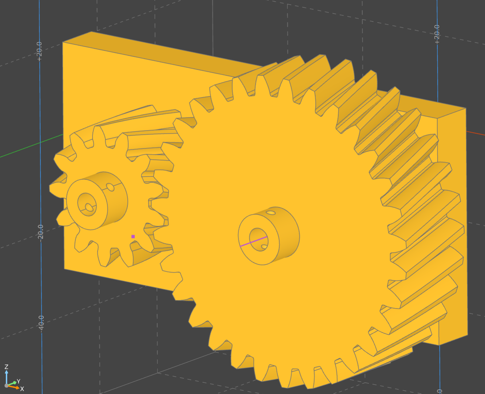
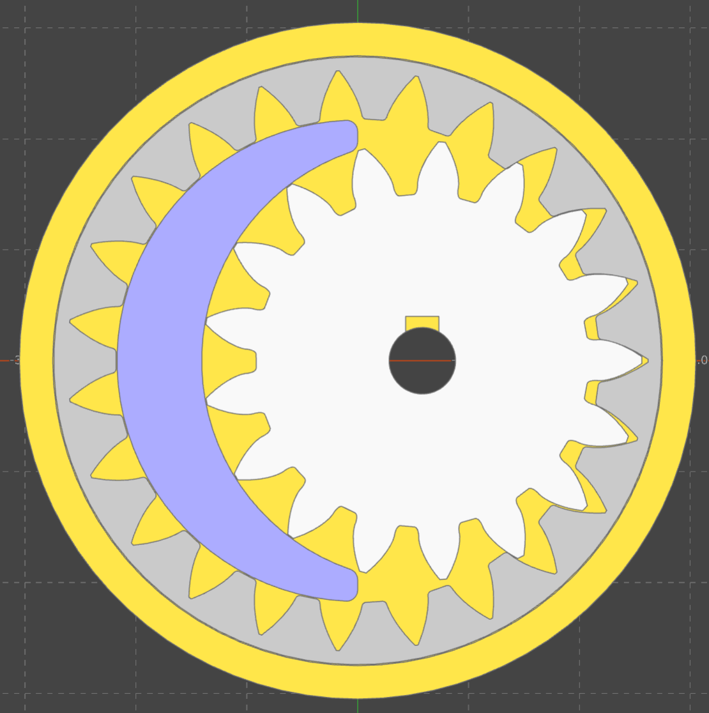
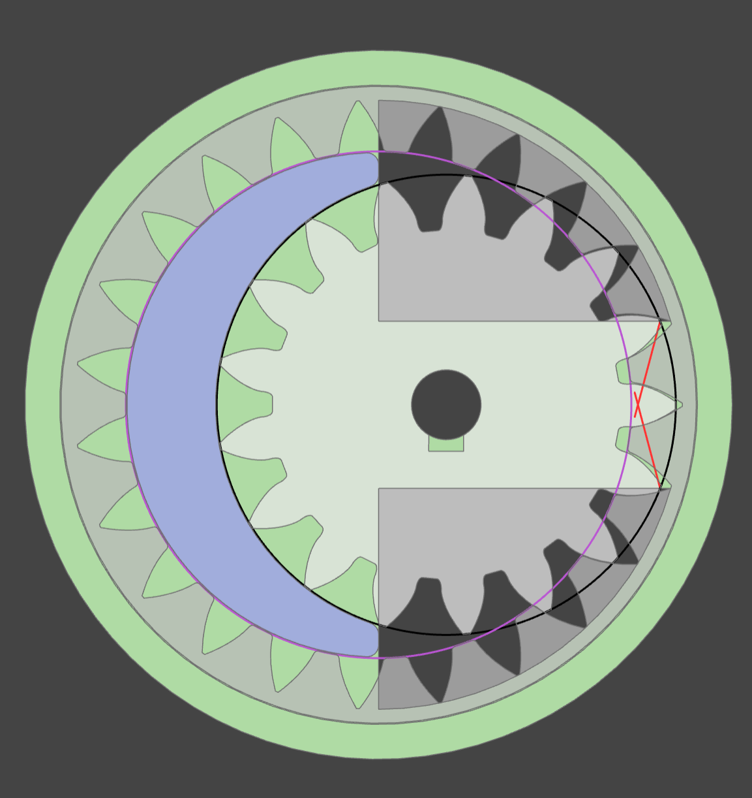

Detailed Workflow Examples
===========================

The following examples demonstrate complete mini-projects using py_gearworks along with `build123d <https://github.com/gumyr/build123d>`_. 
The examples are available in the `examples` folder of the repository.

These examples were developed in Visual Studio Code, with the `OCP CAD Viewer <https://marketplace.visualstudio.com/items?itemName=bernhard-42.ocp-cad-viewer>`_ extension for visualization. 
The examples can be run in any Python environment, but the OCP CAD Viewer (and ocp_vscode python package) is necessary for the `show()` and `animate()` methods to work.

Simple gears on a backplate
----------------------------

Various properties and methods are made available in the class :py:class:`GearInfoMixin <py_gearworks.wrapper.GearInfoMixin>`. 
The following example demonstrates the creation of a gear-pair and attaching them to a base-plate: 

Highlights:

* You can use \
  :py:attr:`center_location_bottom <py_gearworks.wrapper.GearInfoMixin.center_location_bottom>`, \
  :py:attr:`center_location_top <py_gearworks.wrapper.GearInfoMixin.center_location_top>`, \
  :py:attr:`face_location_bottom <py_gearworks.wrapper.GearInfoMixin.face_location_bottom>`, \
  :py:attr:`face_location_bottom <py_gearworks.wrapper.GearInfoMixin.face_location_bottom>` to align parts with gear centers.
* Note that **center** refers to the pitch circle center and **face** refers to the face (surface) of the gear. These are different for bevel gears.
* :py:attr:`gear.center <py_gearworks.wrapper.GearInfoMixin.center>` is a numpy array, often needs to be converted to a `Vector` for build123d via :py:func:`np2v() <py_gearworks.conv_build123d.np2v>`.
* Ideal center distance can be retrieved after calling the :py:meth:`mesh_to() <py_gearworks.wrapper.InvoluteGear.mesh_to>` method, and calculating the difference of :py:attr:`gear.center <py_gearworks.wrapper.GearInfoMixin.center>` values.

.. literalinclude:: ../../examples/build123d_example.py

Crescent Gear Pump
-------------------

This example demonstrates building a gear pump. The design is missing fasteners and seals,
but showcases the gear generator and its helper functions for build-123d workflow.

Highlights:

* You can use :py:attr:`center_location_bottom <py_gearworks.wrapper.GearInfoMixin.center_location_bottom>`, :py:attr:`center_location_top <py_gearworks.wrapper.GearInfoMixin.center_location_top>`, to align build123d parts with gear centers.
* Reference circles of the gear can be generated using the :py:meth:`build_addendum_circle() <py_gearworks.wrapper.GearInfoMixin.build_addendum_circle>` and :py:meth:`build_dedendum_circle() <py_gearworks.wrapper.GearInfoMixin.build_dedendum_circle>` methods.
* The :py:func:`generate_line_of_contact() <py_gearworks.wrapper.generate_line_of_contact>` function is available for generating the line of contact between gears. Line of contact was used to design blocking section of the side channel.
* Sometimes converter functions are needed such as :py:func:`arc_to_b123d() <py_gearworks.conv_build123d.arc_to_b123d>` and :py:func:`line_to_b123d() <py_gearworks.conv_build123d.line_to_b123d>`. These convert between py_gearworks' own geometry classes and build123d geometry.
* Animation is used from `ocp_vscode` to visualize the gear meshing.

.. literalinclude:: ../../examples/build123d_crescent_gearpump.py

Here you can find the sketches that helped the construction of the crescent and the fluid channels.

